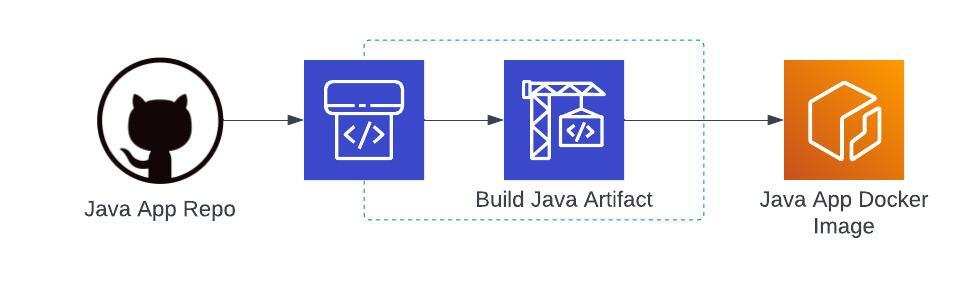

# aws-webinar-demo-gitops
Source code with java Demo application and Continues Integration (CI) pipeline for AWS gitops webinar.

## Overview

In this project, we aim to create java Demo application and Continues Integration pipeline to demonstrate how to utilize GitOps practices in AWS. We will be deploying this Demo java application with Infra as Code (IaC) and Continues Deployment (CD) pipeline defined in this GitHub repo: https://github.com/orbit-cloud-solutions/aws-webinar-demo-gitops. 

## Features

- Spring Boot java app in java/ folder
- IaC scripts for CI pipeline in cicd/ folder
- Docker file in docker/ folder

## Installation

1. Clone this repository: `git clone https://github.com/orbit-cloud-solutions/aws-webinar-demo-gitops-app`
2. Install AWS CDK Python
3. Update config.json with your AWS account number and prefered AWS region
4. Manualy deploy of CI part:
```
cd /cicd/cdk
cdk deploy
```
5. Update java/build.gradle `version = '0.1'` parameter with new version of application and commit it to the remote repo
6. CI piplenie will build new version of java app, run unit tests, build docker image and tag it with current version and push it to ECR repo.

## Continues deployment pipeline(s)


